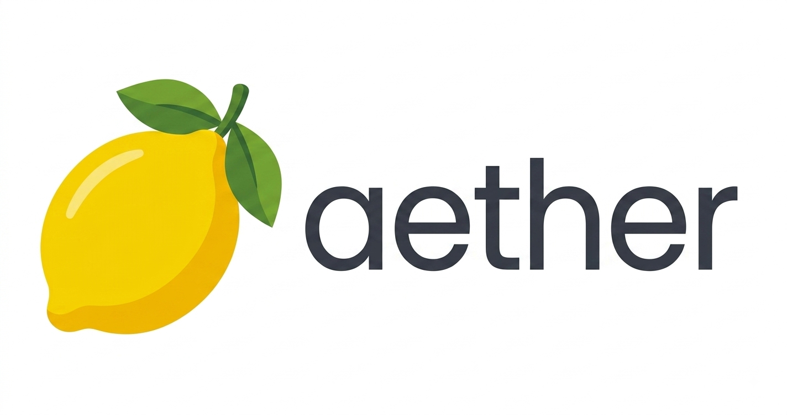

<h1 align="center">
   
  
   
</h1>

<h4 align="center">
  Un emulador experimental de Nintendo 3DS enfocado en el máximo rendimiento para gama de entrada, ligereza y conectividad con Pretendo Network.
</h4>

  
  
  
  

  <a href="#-acerca-del-proyecto">Acerca del Proyecto</a> •
  <a href="#-características-principales">Características</a> •
  <a href="#-base-del-código">Base del Código</a> •
  <a href="#-aviso-importante">Aviso Importante</a> •
  <a href="#-licencia">Licencia</a>

---

## 🍃 Acerca del Proyecto

**Aether** es una bifurcación (*fork*) de emulación diseñada para exprimir al máximo los recursos en teléfonos móviles con hardware ajustado (especialmente optimizado para procesadores MediaTek Helio G85 y procesadores gráficos Mali). 

A diferencia de otras versiones, **Aether** busca dar control total al usuario sobre cada ajuste gráfico y de sistema sin aplicar limitaciones automáticas, permitiendo encontrar la configuración perfecta entre fluidez y calidad visual.

---

## ⚡ Características Principales

| Función | Descripción |
| :--- | :--- |
| 🚀 **Optimización Mali / Helio** | Ajustes específicos para mitigar cuellos de botella en GPUs Mali y optimizar la caché en dispositivos de 4 GB RAM. |
| 🌐 **Pretendo Network Integration** | Conectividad simplificada y soporte directo para jugar en línea en servidores comunitarios de Pretendo. |
| 🏠 **NAND / Home Menu** | Acceso y navegación fluida a los archivos de sistema y al menú principal de la consola. |
| ⚙️ **Panel de Ajustes Avanzados** | Control detallado sobre resolución interna, renderizado asíncrono, *Skip CPU Readback* y más. |
| 🎨 **Interfaz Ligera** | Estética limpia, rápida y diseñada para bajo consumo de batería durante las sesiones de juego. |

---

## 🛠️ Base del Código

Este proyecto toma como punto de partida la base fuente y las herramientas de red desarrolladas en el repositorio de **PabloMK7 Citra**, una labor fundamental dentro de la comunidad de código abierto que ha permitido mantener viva la emulación móvil y la experiencia multijugador online.

---

## ⚠️ Aviso Importante

> **Nota del Desarrollador:**
> **Aether** es un proyecto personal mantenido por un **único desarrollador en solitario**. 
> Al ser un proyecto experimental enfocado en el aprendizaje y la optimización personal, **el desarrollo puede ser pausado, discontinuado o abandonado en cualquier momento** sin previo aviso. Se comparte de manera pública bajo la filosofía de código abierto para que cualquier usuario o desarrollador pueda revisar, probar o continuar el trabajo.

---

## 📜 Licencia

Al estar construido sobre la base original del emulador, **Aether** se distribuye bajo la licencia pública **GPLv2** (o versiones posteriores). Consulta el archivo `LICENSE.txt` para obtener más información.
